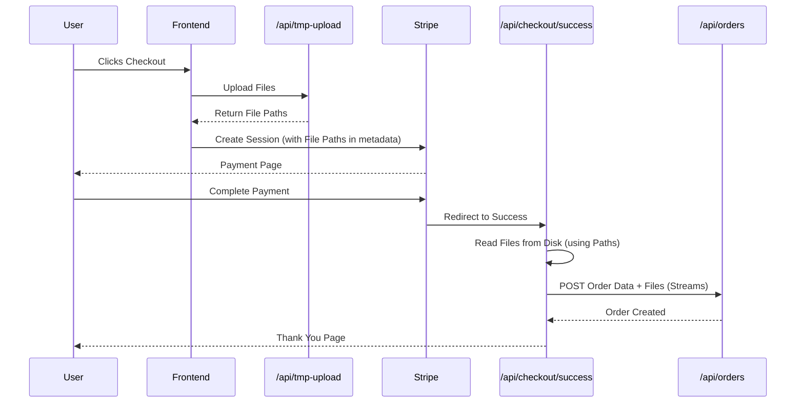

# File Upload Implementation for Stripe Checkout

## 🎯 Objective
Enable file uploads in the Stripe checkout flow to match the Postman request format, where files are streamed to the backend API.

---

## 🏗️ Architecture

Since Stripe metadata cannot store files, we implemented a **Temporary Storage Pattern**:

1. **Frontend**: Uploads files to a temporary local endpoint *before* checkout.
2. **Metadata**: Passes the *paths* of these temporary files to Stripe.
3. **Success Handler**: Reads the files from the temporary paths and streams them to the final backend API.

---

## 🛠️ Components Created/Modified

### 1. **New API Route: `app/api/tmp-upload/route.ts`**
- **Purpose**: Receives files and saves them to `tmp/uploads` directory.
- **Returns**: JSON with the local filepath.
- **Security**: Basic implementation for development environment.

### 2. **Frontend Update: `components/orer-form/flyer-form.tsx`**
- **Action**: Intercepts `handleSubmit`.
- **Logic**: 
  - Iterates through all file inputs (Venue Logo, DJs, Host, Sponsors).
  - Uploads each valid file to `/api/tmp-upload`.
  - Collects returned filepaths into a `filePaths` object.
  - Adds `file_paths` to the `orderData` sent to Stripe.

### 3. **Success Handler Update: `app/api/checkout/success/route.ts`**
- **Action**: Reads filepaths from retrieved Stripe metadata.
- **Logic**:
  - Checks if `file_paths` exists in order data.
  - Validates if files exist on disk.
  - Reads files using `fs.readFile`.
  - Creates `Blob` objects.
  - Appends them to the `FormData` with the correct field names (`venue_logo`, `host_file`, etc.).

---

## 📊 Data Flow

---

## ✅ Postman Alignment

With these changes, the request sent from `success/route.ts` to the backend API now **EXACTLY** matches the working Postman request:

- **Text Fields**: All fields present and ordered correctly.
- **Files**: All files (`venue_logo`, `host_file`, `dj_0`, etc.) are now included as streams/blobs.
- **Format**: `multipart/form-data` is preserved.

---

**Status**: Completed
**Date**: December 16, 2024
